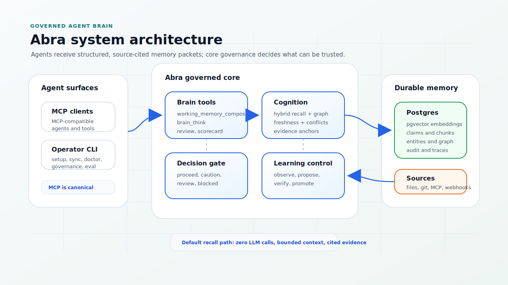
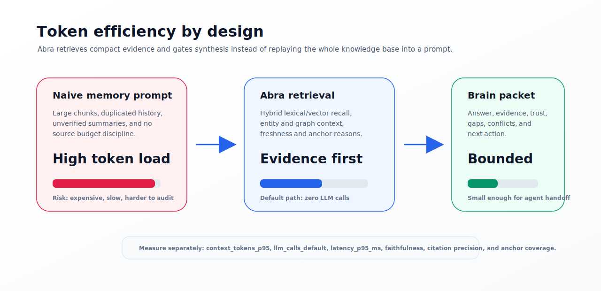

# Abra

Abra is an agent-first, source-cited memory control plane for AI agents.

It gives AI agents a governed external brain for project knowledge, operational
context, and source-backed decisions before they answer questions or change
code. Abra is intentionally not a chatbot, web dashboard, generic RAG box,
vector database UI, or model wrapper.

## What Abra Is For

Use Abra when an agent needs to:

- understand a project or system from source-backed memory;
- retrieve the right context before changing code;
- answer operational questions with citations;
- detect stale, conflicting, or weakly supported memory;
- turn new observations into reviewable learning proposals;
- share one governed memory layer across agent runtimes.

## Why Abra

Agent memory is risky when every observation is treated as truth. Abra keeps
memory useful without letting agents silently promote unverified facts:


The default path is deterministic and no-LLM. Optional synthesis can be enabled
only when evidence, citations, verification, and same-source anchors pass.

## Product Shape

- **MCP-first for agents**: agents use `working_memory_compose`, `brain_think`,
  `brain_review`, `brain_scorecard`, and related tools directly.
- **CLI for operators**: install, setup, source sync, diagnostics, governance,
  eval, brain review, scorecards, maintenance, and entity dossiers.
- **HTTP as transport**: used by MCP, CLI fallbacks, gateways, and private
  automation; not the primary product UX.
- **Postgres + pgvector**: durable source-backed memory, vector retrieval,
  graph relations, policies, approvals, traces, and eval history.
- **Governance in core**: plugins can bring data in, but core owns validation,
  chunking, embeddings, graph extraction, citations, conflicts, approvals,
  memory health, and agent decision gates.

## Architecture



See:

- [Architecture](docs/ARCHITECTURE.md)
- [Repository layout](docs/REPOSITORY_LAYOUT.md)
- [Cognitive architecture](docs/COGNITIVE_ARCHITECTURE.md)
- [Benchmarks](docs/BENCHMARKS.md)
- [Feature freeze](docs/FEATURE_FREEZE.md)

## Quickstart

Install the latest release binary:

```sh
curl -fsSL https://github.com/hermawan22/abra/releases/latest/download/install.sh | sh
```

For repeatable production workstations, pin and verify the release:

```sh
curl -fsSLO https://github.com/hermawan22/abra/releases/download/vX.Y.Z/install.sh
gh attestation verify --repo hermawan22/abra install.sh
ABRA_VERSION=vX.Y.Z ABRA_VERIFY_ATTESTATION=1 sh install.sh
```

Start the local stack:

```sh
abra setup
abra doctor
```

For release-installed CLIs, `abra up` uses the published runtime bundle for the
installed version. For development from a source checkout, run commands from the
checkout so Abra uses local Compose files. If you intentionally test a custom
runtime archive, set both `ABRA_SOURCE_URL` and `ABRA_SOURCE_SHA256`. Mutable
`main`-branch runtime downloads are refused by default; `ABRA_ALLOW_MUTABLE_RUNTIME_SOURCE=1`
is a local-development escape hatch only, not a production install path.

Bootstrap a project for an AI agent:

```sh
cd /path/to/project
abra scope
abra agent bootstrap --agent <agent>
```

Fully restart the agent runtime after bootstrap so the active process reads the
MCP config and token environment. Then verify:

```sh
abra agent verify . --scope <scope-from-abra-scope> --json
```

Agents should then use Abra MCP tools directly. Operators can run a local sanity
check with:

```sh
abra ask "What should I know before changing this project?" --scope <scope>
```

## Core Agent Tools

- `discover_scopes`: find the exact memory scope.
- `working_memory_compose`: build task-specific working memory.
- `brain_think`: return a governed answer with evidence and an agent gate.
- `brain_entity_dossier`: inspect one entity with claims, relations, anchors,
  conflicts, and temporal context.
- `brain_review`: inspect memory health and weak spots.
- `brain_scorecard`: score evidence, anchors, retrieval, freshness, conflicts,
  graph, learning, and eval signals.
- `brain_anchor_backfill`: propose evidence-anchor improvements.
- `brain_maintain`: detect stale claims, weak anchors, conflicts, duplicate
  proposals, missing summaries, and refresh needs.
- `capture_observation` and `capture_task_outcome`: record reviewable raw
  learning signals from agent work.
- `propose_learning`, `list_learning_proposals`, `decide_learning_proposal`,
  and `apply_learning_proposal`: govern promotion from observation to trusted
  memory.

## Why Abra Is Different

Abra is designed as a governed agent brain, not a generic memory library:

- **Evidence before prose**: answers carry citations and evidence anchors before
  optional synthesis can render final text.
- **No-LLM default path**: default recall, review, scorecard, and maintenance
  use deterministic store signals, keeping latency and token cost bounded.
- **Agent decision gate**: every brain packet can tell an agent whether to
  proceed, proceed with caution, request review, or stop.
- **Temporal and conflict-aware memory**: stale, expired, superseded, and
  conflicting claims are labeled instead of being silently recalled as truth.
- **Governed learning**: agents can observe and propose, but trusted memory is
  promoted only through explicit governance.
- **MCP-first UX**: agents receive structured context packets directly; the CLI
  remains an operator console instead of becoming the product surface.



## Operator CLI

The stable operator surface is intentionally small:

| Command | Purpose |
| --- | --- |
| `abra setup` | Configure a local Abra runtime. |
| `abra doctor` | Diagnose runtime, MCP, token, model, and memory readiness. |
| `abra scope` | Resolve the recommended project scope. |
| `abra agent` | Install, initialize, and verify AI-agent integrations. |
| `abra sync` | Refresh a registered source or ingest a local path. |
| `abra connect` | Register local, Git, MCP, or webhook sources. |
| `abra model` | Configure and operate embedding providers. |
| `abra brain` | Inspect and maintain governed brain quality. |
| `abra govern` | Review and apply governed learning proposals. |
| `abra plugin` | Inspect and validate extension contracts. |

Compatibility commands such as `ask`, `context`, `think`, `compose`, `ingest`,
`sources`, `connectors`, and `mcp` remain for scripts and focused debugging, but
MCP is the canonical agent interface.

See [CLI guide](docs/CLI.md).

## Sources And Plugins

Built-in source paths:

- local files and repos: `abra sync . --code --scope repo:project`
- durable local, Git, and MCP sources: `abra connect ...`
- signed webhooks and internal HTTP ingestion for gateways or private automation

Plugin contracts adapt external systems into normalized Abra documents. Source
integrations should live as adapters, MCP exporters, signed webhook producers,
or private overlays.

Plugins must not own trust decisions. They provide source-backed evidence; Abra
core decides what can be used.

See:

- [Extensions](docs/EXTENSIONS.md)
- [Plugin authoring](docs/PLUGIN_AUTHORING.md)
- [Connector examples](examples/connectors)

## Models

Abra can run with the default local Qwen3 embedding provider, or with any
compatible embedding endpoint. The local OSS defaults are
`Qwen/Qwen3-Embedding-0.6B-GGUF:Q8_0` and optional
`Qwen/Qwen3-Reranker-0.6B-GGUF:Q8_0`.

Use the local provider:

```sh
abra model local
abra model up
abra model status
```

Use any compatible embedding provider instead:

```sh
abra model compatible \
  --base-url https://embedding.example/v1 \
  --model embedding-model \
  --dimensions 1024
```

Abra is not tied to a single model provider or hosted AI ecosystem.

## Production

Production deployments require:

- generated API keys and webhook secrets;
- production approval enforcement;
- Postgres with `pgvector`, backups, and restore drills;
- internal network exposure or a gateway;
- digest-pinned container images;
- measured embedding provider capacity;
- release artifacts verified with checksums and attestations.

See [Production readiness](PRODUCTION.md) and [Release process](RELEASE.md).

## Repository Quality

The repository is structured for OSS review:

- Go runtime and CLI live under `cmd/` and `internal/`.
- The database baseline and future migrations are documented under `migrations/`.
- Public docs live under `docs/`.
- Generic examples live under `examples/`.
- Maintainer automation lives under `scripts/`.

`npm` is used only as a repository task runner for QA, eval, release, and OSS
hygiene scripts. Abra is not distributed through npm; the runtime is Go and the
published artifacts are CLI archives plus container images.

## Development

Prerequisites:

- Go 1.25.11 or newer
- Node.js 24 or newer for maintainer scripts
- Docker or a compatible runtime for full release-gate checks
- Postgres with `pgvector` for local integration testing

Run fast checks:

```sh
go test ./...
npm test
```

Run the full local release gate when Docker is available:

```sh
ABRA_RELEASE_PROFILE=full ABRA_RELEASE_MANAGE_STACK=1 npm run release:gate
```

See [Contributing](CONTRIBUTING.md) before opening a PR.

## Security

Do not commit secrets, private business context, customer data, source-system
exports, embeddings, database dumps, or audit logs.

Report vulnerabilities through GitHub private vulnerability reporting. See
[Security](SECURITY.md).

## License

Apache-2.0. See [LICENSE](LICENSE).
