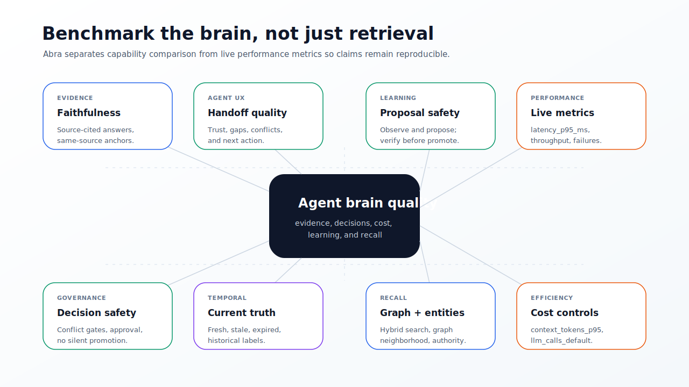

# Brain Benchmarks

Abra should be evaluated as a governed agent brain: retrieval quality matters,
but so do evidence, token efficiency, temporal correctness, conflict handling,
and agent handoff quality.



## Compared Systems

The benchmark tracks the agent-memory capabilities commonly emphasized by other
memory systems:

| System | Publicly documented strength | Abra response |
| --- | --- | --- |
| Mem0 | New memory algorithm with ADD-only extraction, hybrid search, and entity linking. | Abra uses source-backed claims, hybrid lexical/vector recall, entity/graph recall, and governed proposal-based learning. |
| Graphiti / Zep | Temporal context graph with provenance, hybrid retrieval, and facts that evolve over time. | Abra keeps temporal claim metadata, freshness, supersession, relation filtering, provenance, and historical context labels inside Postgres. |
| Letta | Stateful agents with core memory in context and archival memory queried by tools. | Abra exposes `core`, `agent_core`, and shared summaries as governed working-memory blocks while keeping trusted writes behind review. |
| Cognee | Graph, vector, and relational memory pipeline for agent recall. | Abra keeps graph, vector, relational records, policy, audit, approvals, traces, and eval history in one lean Postgres baseline. |

References:

- Mem0 migration guide: <https://docs.mem0.ai/migration/oss-v2-to-v3>
- Graphiti overview: <https://help.getzep.com/graphiti/getting-started/overview>
- Letta stateful agents: <https://docs.letta.com/guides/core-concepts/stateful-agents/>
- Letta archival memory: <https://docs.letta.com/guides/core-concepts/memory/archival-memory/>
- Cognee documentation: <https://docs.cognee.ai/>

## What Abra Must Win

Abra does not try to win by becoming a larger platform. It should win on the
brain contract that matters to autonomous coding and operational agents:

- **Faithfulness**: answers must cite source-backed evidence.
- **Anchor quality**: verified claims should have same-source quotes or spans.
- **Decision quality**: agent handoff must say whether autonomous action is
  safe.
- **Conflict handling**: contradictions block unsafe autonomous use.
- **Temporal correctness**: stale, expired, and superseded facts are not treated
  as current truth.
- **Token efficiency**: context packets stay bounded; default recall does not
  call an LLM.
- **Learning safety**: agents observe and propose, but do not silently promote
  trusted memory.


## Capability Matrix

`node scripts/abra-brain-benchmark.mjs` reports a normalized
`capability_score` from `0.000` to `1.000`. This score is a feature coverage
rating from the matrix below. It is not latency, throughput, token count, or
accuracy.

| Dimension | Abra target | Why it matters |
| --- | --- | --- |
| Source-cited answer | Required | Agents need inspectable evidence before acting. |
| Same-source anchor | Required for synthesis | Prevents polished unsupported prose. |
| No-LLM default query path | Required | Keeps cost, latency, and hallucination risk bounded. |
| Optional synthesis | Evidence-gated | Provides natural prose only after retrieval is safe. |
| Graph recall | Built into core | Links entities, relations, code areas, and decisions. |
| Temporal recall | Built into core | Separates current truth from historical context. |
| Governance | Built into core | Blocks silent truth writes by agents and plugins. |
| MCP-first UX | Required | Agents receive structured memory directly. |
| CLI scope | Operator only | Keeps product lean and scriptable. |
| Storage | Postgres + pgvector | Avoids a required external graph service in core. |

## Capability Score vs Performance Metrics

| Field | Unit | Meaning |
| --- | --- | --- |
| `capability_score` | Normalized `0.000` to `1.000` | Weighted feature coverage from the documented capability matrix. |
| `context_tokens_p95` | Tokens | 95th percentile working-memory packet size. |
| `llm_calls_default` | Count | Number of LLM calls on the default recall path; expected value is `0`. |
| `latency_p95_ms` | Milliseconds | 95th percentile brain packet generation latency from a live perf run. |

Only `latency_p95_ms` is latency. The capability score should be used for
product positioning; live eval and perf runs should be used for speed and token
efficiency.

## Benchmark Protocol

Benchmark runs should report both answer quality and operating cost:

| Metric | Meaning |
| --- | --- |
| `faithfulness_pass_rate` | Answer only uses supported evidence. |
| `citation_precision` | Cited sources support the answer. |
| `anchor_coverage` | Claims have quote/span evidence. |
| `conflict_block_rate` | Conflicts produce review gates instead of proceed gates. |
| `temporal_accuracy` | Expired or superseded memory is labeled correctly. |
| `handoff_completeness` | Agent receives trust, gaps, conflicts, next action, and validation plan. |
| `context_tokens_p95` | Working-memory packet remains within the target budget. |
| `llm_calls_default` | Default recall path uses zero LLM calls. |
| `latency_p95_ms` | Brain packet generation stays bounded. |

Run Abra's built-in deterministic benchmark suite:

```sh
node scripts/abra-brain-benchmark.mjs
abra eval brain --suite canonical --json
abra eval brain --file examples/evals/brain/benchmark.json --json
```

For live deployments, run the broader release/eval gates:

```sh
npm run eval:golden
npm run eval:tier1
npm run eval:tier23
npm run perf:local
```

## Reporting Rules

Do not publish cross-library benchmark numbers unless the harness, data, model
configuration, embedding provider, reranker provider, and hardware are included
with the report. Use the capability matrix for product comparison and use the
eval suite for measurable Abra quality.

The default expected Abra result is:

- `llm_calls_default = 0`
- bounded context packet
- citations present
- same-source anchors present for synthesis-eligible answers
- conflicts and stale facts represented as gates or gaps
- learning writes represented as proposals unless explicitly approved
