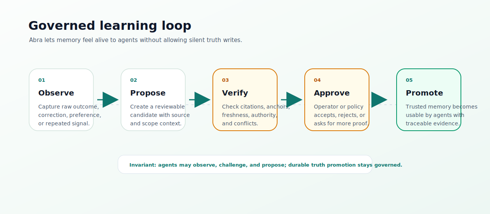

# Abra Operator CLI

Abra is agent-first. The canonical brain interface is MCP; the CLI is an
operator console for install, setup, verification, source sync, debugging, and
evaluation.

HTTP exists as service transport for MCP, CLI fallbacks, and private
automation. Avoid treating raw HTTP routes as the primary product surface unless
you are building an internal gateway or integration.

## First Run

```sh
abra setup
abra doctor
```

`setup` creates local configuration and starts the default stack. The default
embedding path is local-first; no hosted AI provider, npm package install, or
cloud account is required.

For a project:

```sh
cd /path/to/project
abra scope
abra agent bootstrap --agent <agent>
```

Fully quit and reopen the AI client after bootstrap if it installed MCP config.
Then verify the exact scope:

```sh
abra agent ready . --scope <scope-from-abra-scope> --json
```

Ask Abra from the operator console:

```sh
abra ask "What should I know before changing this project?" --scope <scope-from-abra-scope>
```

## Canonical Commands

| Command | Purpose |
| --- | --- |
| `abra setup` | Configure Abra. |
| `abra up` | Start the local stack. |
| `abra down` | Stop the local stack. |
| `abra doctor` | Diagnose runtime, MCP, token, model, and memory readiness. |
| `abra scope` | Print the recommended scope for the current project. |
| `abra connect` | Register durable local, Git, MCP, or webhook sources. |
| `abra sync` | Refresh a source or ingest a local path now. |
| `abra agent` | Install, initialize, and verify AI-agent integrations. |
| `abra model` | Configure and operate embedding providers. |
| `abra brain` | Inspect and maintain source-backed brain quality. |
| `abra govern` | Inspect approvals, observations, and decision gates. |
| `abra plugin` | Inspect extension contracts. |

`abra ask` and `abra context` remain available for operators and scripts, but
agents should use MCP tools directly.

Use `abra help <command>` for focused help.

## Source Flow

For a one-time local project sync:

```sh
abra sync . --code --scope <scope>
```

For a durable local source watched by Abra workers:

```sh
abra connect local . --scope <scope> --schedule "@every 10m"
```

For a remote git source:

```sh
abra connect git https://github.com/owner/repo.git \
  --ref main \
  --scope repo:owner-repo \
  --schedule "@every 10m"
```

For a user-owned MCP exporter:

```sh
abra connect mcp https://mcp.example.com/mcp \
  --tool export_documents \
  --scope team:docs \
  --dry-run
```

Run the same command without `--dry-run` after the export returns normalized
Abra documents.

Refresh an existing source:

```sh
abra sync <source-config-id> --wait --wait-timeout 10m
```

Inspect source health:

```sh
abra connect status <source-config-id>
abra connect logs <source-config-id> --limit 20
```

## Agent Flow

Bootstrap an agent:

```sh
abra agent bootstrap --agent <agent>
```

Manual steps:

```sh
abra agent install <agent>
abra agent init --agent <agent>
abra agent verify . --scope <scope>
```

Use `agent verify` before assuming an AI client can see Abra. If the server is
ready but the active client still has no Abra tools, reinstall the MCP config
and fully restart the client.

## Model Flow

Use the built-in local embedding runner:

```sh
abra model local
abra model up
abra model status
```

Use any compatible embedding provider instead:

```sh
abra model compatible \
  --base-url https://embedding.example/v1 \
  --model embedding-model \
  --dimensions 1024
```

Custom providers replace the local path. Abra does not lock users to any single
model provider or hosted AI ecosystem.

## Working With Agents

Agents should use MCP as the brain interface:

- `discover_scopes`
- `working_memory_compose`
- `brain_think`
- `brain_entity_dossier`
- `brain_review`
- `brain_scorecard`
- `brain_anchor_backfill`
- `brain_maintain`

The usual agent loop is to discover the scope, compose working memory, act with
citations, observe the outcome, and propose learning through the governed path.



`abra context` is the operator fallback for inspecting the packet an agent would
receive:

```sh
abra context "Implement the payment retry fix" --scope <scope> --prompt
abra context "Implement the payment retry fix" --scope <scope> --agent-output
```

It returns scope-aware memory, citations, conflicts, impact map, validation
plan, and the decision gate. Use `--agent-output` when handing the packet to
another AI client, or `--brief` when an operator only needs the trust and
context summary. Agents should call `working_memory_compose` through MCP before
implementation work.

`abra ask` is for human/operator questions:

```sh
abra ask "Which files explain deployment?" --scope <scope>
abra ask "Which files explain deployment?" --scope <scope> --brief
abra ask "Which files explain deployment?" --scope <scope> --agent-output
abra ask "Which files explain deployment?" --scope <scope> --synthesize
```

Use `--mode fast|balanced|deep` on `ask`, `think`, `context`, and `compose`:

- `fast` caps fanout and token budget for low-cost recall.
- `balanced` is the default governed packet with summaries, graph, health, and anchors.
- `deep` expands evidence and graph context, but still does not synthesize unless `--synthesize` is explicit.

`--synthesize` is opt-in and only works when the server is configured with
`ABRA_SYNTHESIS_ENABLED=true` and an extractor/chat provider through
`EXTRACTOR_*` or `LLM_*`. Abra still retrieves, verifies, cites, and anchors
evidence first; synthesis is a rendering layer and falls back to deterministic
output when disabled, blocked, or rejected.

Brain responses include `evidence_anchors` when source chunks contain
same-source quotes or text spans for recalled claims. These anchors strengthen
citations and are required by the optional synthesis gate.

Inspect and maintain brain quality without an LLM call through MCP:

- `brain_review`
- `brain_scorecard`
- `brain_anchor_backfill`
- `brain_maintain`

`brain_review` returns memory health, weak anchors, stale or expired claims,
conflicts, source freshness, duplicate proposals, metrics, and next actions.
`brain_scorecard` breaks quality into evidence, anchors, retrieval, freshness,
conflicts, graph, learning, and eval readiness. Anchor backfill and maintain
default to dry-run/proposal-safe behavior and never promote trusted memory
directly.

The CLI intentionally does not mirror those maintenance tools as first-class
commands. Use `abra brain status`, `abra doctor`, and `abra agent ready` for
operator checks; agents should call the MCP tools directly.

Run answer-quality suites with:

```sh
abra eval brain --suite canonical
abra eval brain --file brain-eval.json
```

Eval cases can require minimum verdicts, agent decisions, citation refs, answer
text, forbidden text, and claim evidence anchors. The command exits non-zero
when any case fails, making it suitable for CI or release gates.

## Plugins

Core Abra does not ship source-system-specific or private-company logic.
Extensions adapt external systems into normalized documents:

```sh
abra plugin list
abra plugin contract
```

Advanced connectors can be implemented as:

- MCP exporters consumed by `abra connect mcp`;
- signed webhook producers;
- internal HTTP batch ingestion jobs;
- private deployment overlays.

## Compatibility Aliases

These commands remain for scripts and existing users, but they are not the
primary documentation path:

| Older command | Preferred operator command |
| --- | --- |
| `ingest` | `sync` |
| `think` | `ask` |
| `compose` | `context` |
| `agents` | `agent` |
| `models` | `model` |
| `sources` | `connect` / `sync` |
| `connectors` | `plugin` / `connect` |
| `mcp` | `agent install` / `agent status` |

Do not add new top-level aliases without updating
[FEATURE_FREEZE.md](FEATURE_FREEZE.md).
