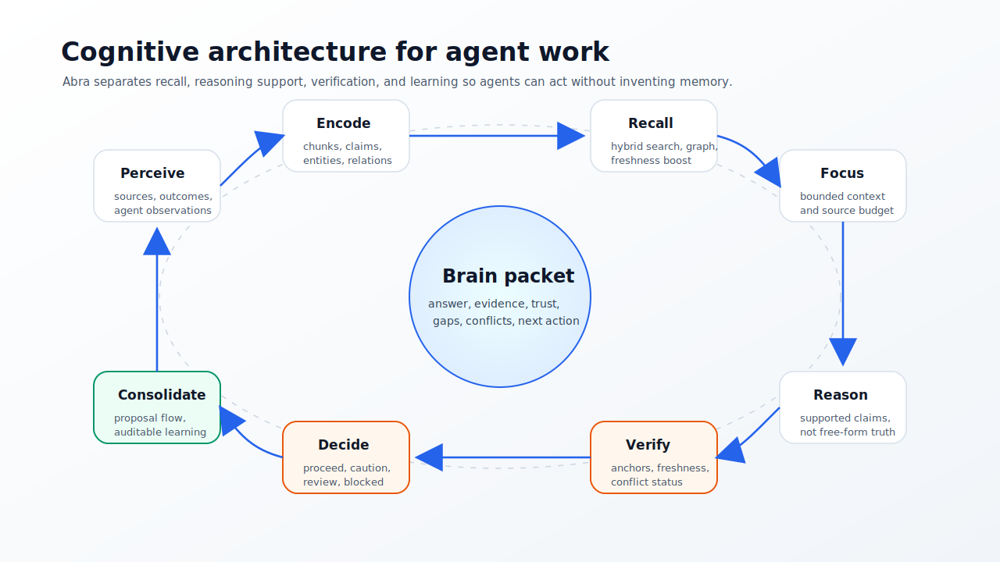

# Cognitive Architecture

Abra is an external governed brain for AI agents. It is not trying to be an AGI
or a chat model. Its job is to give agents memory, attention, working context,
evidence, uncertainty, and a decision gate while staying lean, source-backed,
and deterministic by default.

## Product Boundary

The canonical interface is MCP. An agent should call Abra as a brain before it
answers, plans, or changes code.

The CLI is an operator console for install, setup, source sync, verification,
maintenance, and evaluation. HTTP is service transport for MCP, CLI, and
automation. HTTP endpoints are not the product surface to optimize first.

## Brain Loop

Abra's cognitive loop:

Each step is bounded and inspectable:

- Perceive: ingest source-backed inputs, observations, task outcomes, and
  connector records.
- Encode: normalize documents, chunks, claims, entities, relations, summaries,
  embeddings, authority, freshness, and provenance.
- Recall: retrieve relevant memories with hybrid lexical, semantic, entity,
  graph, freshness, authority, and evidence signals.
- Focus: build a compact working memory packet instead of returning raw search
  results.
- Reason: form supported claims, gaps, conflicts, hypotheses, and next actions
  from retrieved evidence.
- Verify: check source coverage, anchor coverage, freshness, conflicts,
  retrieval quality, and memory health.
- Decide: return an executive gate such as proceed, caution, needs review, or
  unsafe.
- Respond: hand the agent an answer or working context with citations and trace.
- Observe: capture raw outcomes, corrections, and repeated patterns as
  observations.
- Consolidate: create reviewable proposals; promote only through governance.

## Memory Types

Abra keeps memory typed instead of treating every record as one vector row.

| Memory kind | Stored meaning |
| --- | --- |
| `archival` | Documents, chunks, and source records. |
| `semantic` | Verified and inferred claims. |
| `episodic` | Observations and task outcomes. |
| `associative` | Entities and temporal relations. |
| `procedural` | Reviewed operational or coding practices. |
| `core` | Compact project-level memory summaries. |
| `agent_core` | Compact agent behavior and preference summaries. |

Only reviewed, source-backed memory should become trusted memory. Raw
observations are useful signals, not facts.

`core` and `agent_core` summaries are pulled into working-memory packets as
high-priority context blocks before task-specific recall, so agents get compact
identity, constraints, and behavior memory without a new database or default LLM
call.

## Attention Scoring

Recall should behave like attention, not plain nearest-neighbor search. The
ranking contract is explainable: Abra combines semantic similarity, lexical
match, entity match, graph neighborhood, source authority, freshness, evidence
anchor strength, and historical success signals, while penalizing stale,
expired, conflicting, challenged, or unverified memory.

The score is not a hidden LLM judgment. It is assembled from store signals and
returned through retrieval reasons, ranking metadata, and why traces.

## Working Memory

The agent should receive a compact packet that looks like active working
memory. The packet contains task, intent, scope, retrieval mode, active context,
evidence, citations, evidence anchors, entity dossiers, temporal context, graph
paths, hypotheses, gaps, conflicts, trust, decision gate, next actions, and why
trace.

This packet is the primary value of Abra. It is what lets a model act with
memory without spending tokens re-reading an entire repository or trusting
unsourced text.

Entity dossiers are compact, deterministic working-memory objects for one
entity. They contain active claims, active graph relations, evidence anchors,
conflicts, trust status, temporal context, and a recommended next action. They
are built from the same governed retrieval packet, so they do not add an LLM or
new storage dependency to the default path.

## Reasoning Contract

Abra's default reasoning is deterministic:

1. Retrieve source-backed memories.
2. Prefer fresh, verified, anchored, high-authority evidence.
3. Penalize stale, challenged, unverified, expired, or conflicting memory.
4. Build supported claims and cite their sources.
5. Surface gaps and conflicts instead of hiding uncertainty.
6. Decide whether the agent can proceed autonomously.

Optional synthesis may render the final prose, but it must pass citation,
verification, and evidence-anchor gates. Synthesis is not a truth source.

## Learning Contract

Learning is governed:

Agents may observe, challenge, and propose. They may not silently promote
trusted memory. This keeps Abra useful as a brain without turning every agent
utterance into long-term belief.

Useful learning signals include:

- repeated observations across tasks;
- user corrections;
- task outcomes;
- validation results;
- source refreshes;
- conflict resolutions;
- stale or expired claim detection;
- high-confidence anchor backfills.

## Metacognition

A useful brain knows when it knows, when it is uncertain, and why. Abra exposes
metacognition through:

- verification verdicts;
- retrieval reasons;
- why traces;
- memory health;
- gaps;
- conflicts;
- scorecards;
- eval reports;
- next actions.

The agent handoff should include language like:

- `claim is stale`
- `source needs refresh`
- `conflict blocks autonomous use`
- `anchor missing, synthesis blocked`
- `proposal ready for review`

## Evaluation

Brain quality should be measured, not guessed. Eval suites should track:

- retrieval relevance;
- citation precision;
- evidence-anchor coverage;
- stale/expired claim handling;
- conflict blocking;
- answer faithfulness;
- decision quality;
- learning proposal quality;
- token budget;
- latency.

The goal is not bigger UX. The goal is a better, leaner cognitive substrate for
agents.
